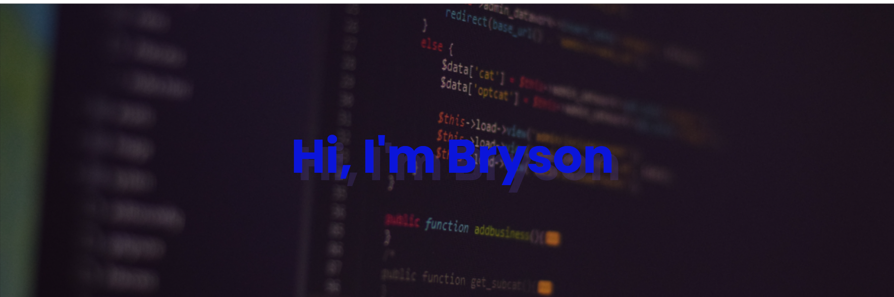

<!--  -->

<!--  -->

<!--  -->
<!-- 

 -->

Diligent, Creative, technical & design-savvy Software Engineer. Excited to blend graphic design experience with hands-on technical training in a junior-level front-end software engineering role. Eager to build innovative and cutting edge business solutions for the impressive suite of clients within its global reach.
 

Always curious to learn cutting edge technology.
 

 🏉 Fun fact: I love to play rugby. 

<!-- - 👨 I’m currently working on Web Development.

- 💡 Currently Learning React.

- 🤔 Always curious to learn cutting-edge technology. A bit enthusiast towards software development.

- 🤝 I’m looking to collaborate with other developers.

- c

- Get in touch ➡️ brysonmundia@gmail.com -->

---

<!-- ## My Skills  🚀 -->
<!-- 

     
     
     
     
     
     
     
     
     
     

 -->

<!-- ## Frameworks 🎗️ -->
<!-- 

 -->

<!-- 

 -->

## Connect with Me just with a click 🤝🏻

<!-- <h2 align="center"> Upcoming Projects </h2>  -->

<!-- <h2 align="center"> Connect with me: </h2> -->

<!-- -->
<!--  -->

---

